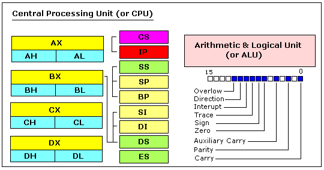

Assembler converts assembly code into numbers/binary and the task itself is called assembling.  
A collection of numbers is also known as a machine language

## Processor

If we have executable files that is generated by the assembler, this file will be stored on the hard disk device. The processor will then move the executable into memory and read and execute the instructions in memory

Architecture of 8086 processor

# General Registers
Register is a 16-bit storage inside the processor. It has the same role as memory. However, memory and processors are connected by a wire (system-bus) and the memory device is slower than the processor, so the processor must wait a while to read the data in memory. However, because the registers are inside the processor, they can be read very quickly. The speed difference is at least 10,000 times.  
 Accessing memory is like the transfer of a delivery between cities while accessing register is like taking things out of your pocket. A car which transfers things between cities can carry big carrages but takes a long time. You can take out your pocket items quickly, but there is a drawback that you can not put big things in it.

So, when processor does something, it reads as much data as possible from the memory into the registers and performs calculation with only the register as much as possible.

#### 8086 processor has 8 general registers.

* AX: called as accumulation register or called as arithmetic register. It is mainly used for calculations.
* BX: This is called as base address register. It is mainly used when calculating memory addresses.
* CX: This is called as counter register. It is mainly used to remember how many times you are repeating in the loop.
* DX: Data register. The result of the calculation is stored or the data read from memory is saved.
* SI: This is called as source index register. Used to store the address of the original data in memory copying.
* DI: This is called the destination index register. It is used to store the address of destination in memory copy etc.
* BP: Base Pointer Register. Used to preserve stack addresses when calling function.
* SP: Stack Pointer Register. The current stack address is saved.

All registers are 16 bits. Especially, AX, BX, CX, DX can be divided into high 8-bit and low 8-bit. The names of high 8-bit are AH, BH, CH, DH. And low 8-bit are AL, BL, CL, DL. When doing some calculations, this calculation can only use 8 bits if it is a calculation that does not require 16 bits

# Segment register  
8086 has several registers called as segment registers

- CS: The address of the segment where the current program is saved is saved.
- DS: The address of the segment where the current data is stored is saved.
- ES: It has no purpose and stores the segment address of the desired memory location whenever necessary.
- SS: The address of the segment with the stack is saved.

`Segmentation is a concept to make computer support more memory`. In the 8086, all registers are 16 bits. Therefore, the register that stores the memory address is also 16 bits. 16 bits are 2 ^ 16, so 2 ^ 10 * 2 ^ 6 = K * 64 = 64K. My laptop has 4G memory. Since the register of the processor of my laptop is 64 bits my laptop can have 4G or bigger memory. Because 8086 has only 16 bits register, 64K is the maximum value that a register can have. But 64K is too small. In the ancient days, bigger memory was also better. So Intel created a way to expand the memory size by use two registers. It would be 32-bit if you put two 16-bit register together, but at that time technology could not make it that big. They only could increase just one nibble. That's it. For example, store 1230h in the DS register and 45h in the SI register. Then the actual address of the memory to be accessed is 1230h * 10h + 45h = 12300h + 45h = 12345h.

That is, a 16-bit register can display only 16-bit, 4-digit addresses like 1234h, but it can be used to display a 5-digit 20-bit address by using a segment register. Then you will be able to connect 1M of memory to the processor because 20-bit can cover 2 ^ 20 = 1M

# Special purpose register
They are special registers that can not be written and read directly.These two registers can not be changed by the programmer. The processor automatically changes the value when the program is executed. So both are registers that tell you the state of the processor.

- IP: Instruction Pointer register. Indicates the address of the next instruction to be executed.
- Flag register: indicates the status of the processor.